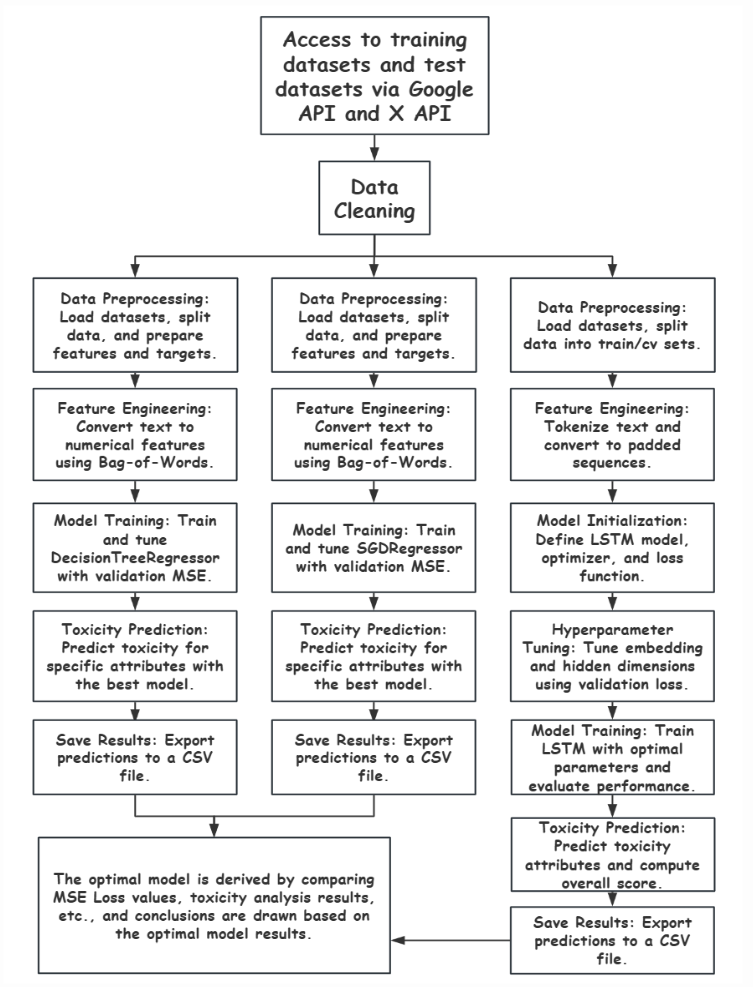
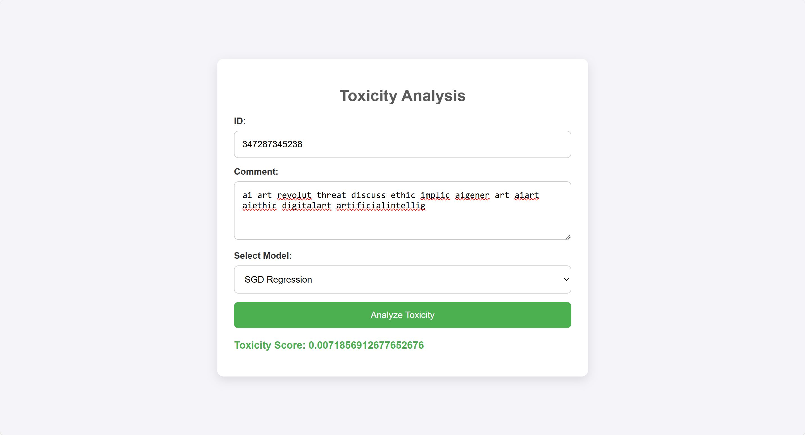

# Toxic Comments Detection System in AI Art
Team members: Chenxi Guo, Jiayi Peng, Xun Lei, Yiran Tao

# **Introduction**

## **Problem Statement**  
In today's era of information explosion, social media has become a major platform for the public to express their views, share information, and discuss hot topics. However, we have to admit that most online discussions today are controversial, and the anonymity of the internet often amplifies toxic comments. Such content can hinder healthy discourse, harm individual mental well-being, and disrupt social stability.

One of the emerging hot topics in recent years is **AI Art**. AI-generated art has sparked intense debates, with some praising its innovation and others questioning its impact on traditional art and creativity. As more people discuss AI art online, opinions range from admiration to doubt. However, toxic comments often appear, which can make these discussions less open and welcoming.

Our project aims to analyze how people feel about AI-generated art by identifying toxic content in online discussions. By exploring public sentiment and classifying toxicity, we hope to gain deeper insights into the emotional and social dynamics surrounding AI art.

## **Solution**  
To address the challenges of identifying and classifying toxic comments, we propose a comprehensive **toxicity analysis pipeline** that integrates natural language processing (NLP), machine learning, and deep learning models. The solution focuses specifically on **AI art discussions**.  

We achieve this by:  
1. Collecting AI art-related comments via APIs and pre-labeled datasets.  
2. Preprocessing and cleaning the text data for clarity and uniformity.  
3. Implementing multiple models, including **SGDRegressor**, **DecisionTreeRegressor**, and **LSTM**, to predict toxicity scores.  
4. Evaluating and comparing model performance using **Mean Squared Error (MSE)**.  
5. Exporting predictions for further analysis and providing a practical web-based application for toxicity detection.

(All the notebooks have been placed in the archive_notebooks folder for organization and future reference.)
---

# **Workflow**

The project workflow consists of the following stages:

### **1. Data Access and Collection**  
- **Test Data**: Tweets containing the query **"AI Art"** were collected using the **X API** (formerly Twitter API) via the Tweepy library. To ensure efficient data collection, rate limits were dynamically managed with multiple API keys.  
- **Training Data**: The labeled dataset from the [Jigsaw Unintended Bias in Toxicity Classification](https://www.kaggle.com/c/jigsaw-unintended-bias-in-toxicity-classification/data) competition was used. This dataset contains comments labeled with toxicity scores (ranging from 0 to 1).  

To ensure dataset integrity:  
- Duplicates were removed based on unique tweet IDs.  
- Essential fields such as **tweet ID**, **text**, and **timestamp** were retained.

### **2. Data Cleaning and Preprocessing**  
After collecting the data, we applied a rigorous cleaning pipeline to standardize and prepare the text data:  
- **Removal of Noise**: Hashtags, mentions, URLs, emojis, punctuation, and non-English text were removed.  
- **Text Standardization**: All text was converted to lowercase for uniformity.  
- **Stopword Removal and Stemming**: Stopwords were filtered out using the **NLTK library**, and stemming was applied to reduce words to their root forms.  
- **Duplicate Removal**: Duplicate entries were eliminated to avoid redundancy.

The cleaned datasets were structured into **Pandas DataFrames** and exported as **CSV files** for subsequent analysis and model training.

### **3. Feature Engineering**  
- For **SGDRegressor** and **DecisionTreeRegressor**, text data was converted into numerical representations using the **Bag-of-Words** method.  
- For **LSTM**, the text data was tokenized, padded, and transformed into word embeddings (e.g., pre-trained GloVe embeddings) to preserve semantic meaning.

### **4. Model Implementation**  
Three models were implemented for toxicity prediction:  

- **SGDRegressor**:  
  - A linear regression model optimized with stochastic gradient descent.  
  - Trained using Bag-of-Words features and validated using **Mean Squared Error (MSE)**.  

- **DecisionTreeRegressor**:  
  - A non-linear model trained to segment the input space based on feature values.  
  - Hyperparameters were fine-tuned to mitigate overfitting.  

- **LSTM (Long Short-Term Memory)**:  
  - A deep learning model capable of capturing long-term dependencies in sequential text data.  
  - Input text was tokenized and passed through LSTM layers with pre-trained embeddings, and the model was optimized using validation loss.  

### **5. Model Evaluation and Results**  
- Models were evaluated using **Mean Squared Error (MSE)** to ensure consistent comparison.  
- Predictions were saved in **CSV format** for further analysis.  
- The model with the best performance (lowest MSE) was selected for deployment.

---
# **Package**

## **Goal**  

This package is designed for analyzing the toxicity of comments, particularly focused on AI art discussions. It utilizes multiple machine learning models such as Decision Tree, SGD Regression, and LSTM to predict toxicity scores based on text input. The core functionality includes text data preprocessing, training, prediction, and evaluation, providing a simple interface for using these models.

The key features of the package include:

    1. Model Training and Prediction: Three machine learning models (Decision Tree, SGD, and LSTM) to predict toxicity scores.

    2. Evaluation: Tools to evaluate the performance of models using metrics such as Mean Squared Error (MSE).

    3. API Integration: Flask-based web application to interact with the models and perform real-time predictions.

## **How to Use**  

For more detailed explanations and usage guidelines, please refer to the full documentation within the README. [Package README](./package/README.md).  

---

# **Data**

The data used in this project consists of:  

1. **Test Data**:  
   - AI art-related tweets collected using the X API.  

2. **Training Data**:  
   - The Jigsaw Unintended Bias in Toxicity Classification dataset.  

Both datasets are stored in a Google Drive folder and can be accessed via the following link:  
[Click Here](https://drive.google.com/drive/folders/1sf55eVN4-7yXEqG6ucAwWtQQ9Klx7KHt?usp=sharing).
---

# **Web App: Toxicity Analysis**

We’ve developed a **Flask-based web application** to analyze the toxicity of comments, specifically targeting AI art discussions. The app uses pre-trained models (**Decision Tree**, **SGD Regression**, and **LSTM**) to predict toxicity scores for user-submitted comments.

### **How to Use**  
To use the app, follow the instructions provided in the [Web App README](./app/README.md).  

### **Demo**  
Here is a demo video showcasing the app in action:  
[Watch Demo](https://drive.google.com/drive/folders/19lgwRHGh3OYQ3scmR-haQzbSbdO8L0MP?usp=sharing).  

### **Web App Interface**  
Here is a glimpse of the web app interface:  

