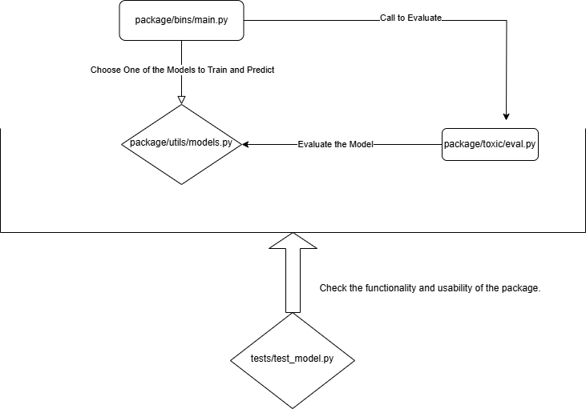

# **Toxicity Detection Package**

A Python package for detecting toxicity in online comments. This package supports multiple models, including Decision Tree, SGD Regression, and LSTM-based models.

---

## **Environment Setup**

### Prerequisites

1. **Python 3.9 or above**  
2. **Poetry** (Python dependency management tool)

### **Install Poetry**

```bash
pip install poetry
```
--- 

## **Install Project**

### Clone the project repository and use Poetry to install all dependencies:
```bash
git clone https://github.com/5400FinalGroup/5400Final.git
cd 5400Final
poetry install
```

---

## **How to Run the Package**

### Command-line Usage
To Install dependencies and scripts
```bash
poetry install
```

To run the main script using Poetry:

```bash
poetry run toxicity_main -test <path_to_test_file> -m <model_type> -o <output_file> -p
```

| Argument             | Required | Description                                                                                   |
|----------------------|----------|-----------------------------------------------------------------------------------------------|
| `-train/--train_file`| Optional | Path to the training dataset file. Defaults to `package/toxic/bin/cleaned_train.csv`.           |
| `-test/--test_file`  | Required | Path to the test dataset file. This file must contain `comment_text` and `id` columns.        |
| `-m/--model`         | Required | Model type. Choose from `Tree`, `SGD`, or `LSTM`.                                             |
| `-o/--output`        | Optional | Path to save predictions. Defaults to `predictions.csv`.                                      |
| `-p/--print`         | Optional | Print results to the console.                                                                |
| `-eval/--evaluate`   | Optional | Evaluate model performance on the training set. Training set must contain a `target` column. |

### Package Architecture Diagram: Workflow and Module Interactions



## **Example Usage**

1. Run SGD Model with Test Data and Output Predictions:
```bash
poetry run toxicity_main -test tests/test_labels.csv -m SGD -o output.csv -p

```

2. Run Decision Tree Model with Evaluation:
```bash
poetry run toxicity_main -test tests/test_labels.csv -m Tree -eval -o predictions_tree.csv

```

3. Run LSTM Model and Print Results:
```bash
poetry run toxicity_main -test tests/test_labels.csv -m LSTM -p

```

## **Data Format Requirements**

### Training Set (`train_file`)
The training dataset must include the following columns:

- `id`: Unique identifier for each comment.
- `comment_text`: The text content of the comment.
- `target`: The toxicity score to be predicted.

**Example:**

| id      | target | comment_text                    |
|---------|--------|---------------------------------|
| 123456  | 0.5    | This is a toxic comment.        |
| 123457  | 0.0    | Nice work, keep it up!          |
| 123458  | 0.9    | You are such an idiot.          |


### Test Set (`test_file`)
The test dataset must include the following columns:

- `id`: Unique identifier for each comment.
- `comment_text`: The text content of the comment.

**Example:**

| id      | comment_text                            |
|---------|----------------------------------------|
| 223456  | I love this movie, it’s fantastic!     |
| 223457  | Terrible experience, not recommended.  |
| 223458  | Neutral comment here.                  |


### Output
The predictions will be saved to the specified output file (`-o/--output`) as a CSV file with the following format:

**Example:**

| id      | comment_text                            | Prediction |
|---------|----------------------------------------|------------|
| 223456  | I love this movie, it’s fantastic!     | 0.1        |
| 223457  | Terrible experience, not recommended.  | 0.8        |
| 223458  | Neutral comment here.                  | 0.3        |


## License
This project is licensed under the **MIT License**.


